# confrisk — Technical Report & Future Roadmap

**Version:** 0.2.0
**Date:** May 24, 2026
**Status:** Production Ready

---

## Executive Summary

**confrisk** is a next-generation security assessment framework that provides **contextual risk scoring** for Linux systems and npm dependencies. Unlike traditional scanners that only report severity, confrisk calculates risk based on business context, asset criticality, and exposure.

### Key Innovations

1. **Contextual Risk Assessment** — Same vulnerability, different risk scores based on environment
2. **Config-Driven Architecture** — Zero code changes for new security checks
3. **Explainable Scoring** — Every risk score includes detailed breakdown
4. **Multi-Scanner** — System scanner + dedicated npm dependency scanner
5. **Git Hooks Integration** — Prevent commits with security vulnerabilities

### Quick Stats

| Metric | Value |
|--------|-------|
| **Lines of Code** | ~2,500 (Rust) |
| **Documentation** | ~10,000 lines |
| **Security Categories** | 12 (extensible) |
| **Detection Methods** | 5 types |
| **Output Formats** | HTML, JSON, Text |
| **Supported Platforms** | Linux, macOS, Docker |
| **Dependencies** | Zero runtime deps (except serde) |

---

## System Architecture

### High-Level Architecture

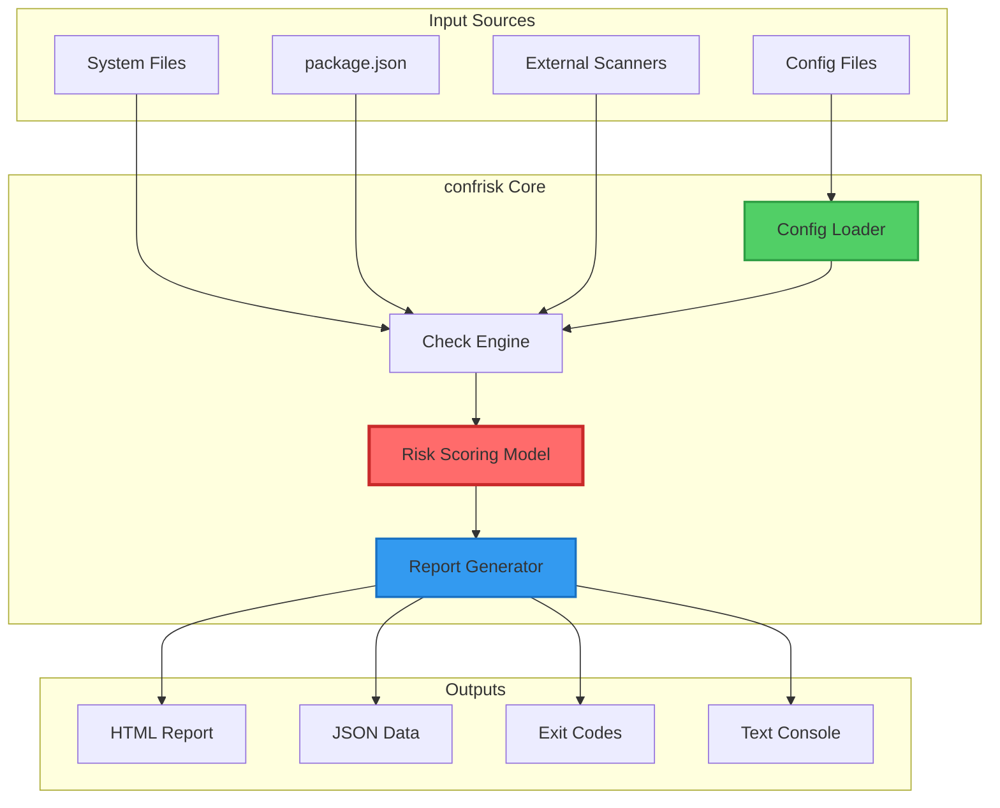

### Component Breakdown

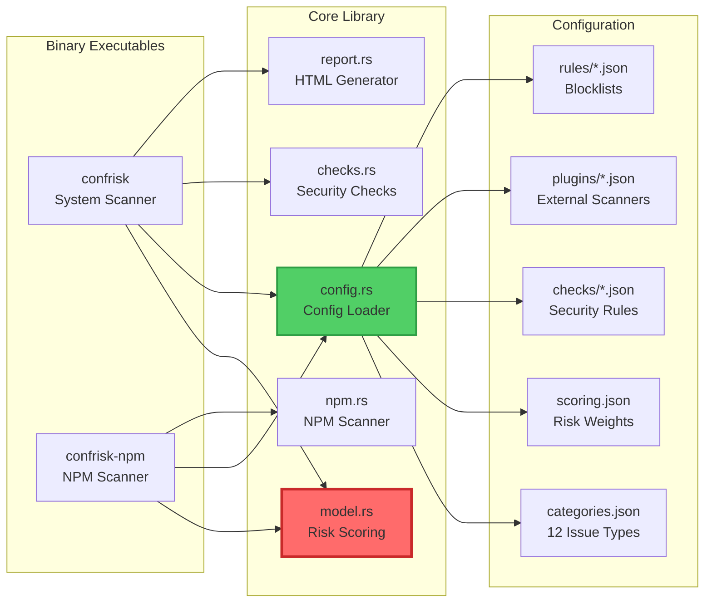

---

## Risk Scoring Model

### Scoring Formula

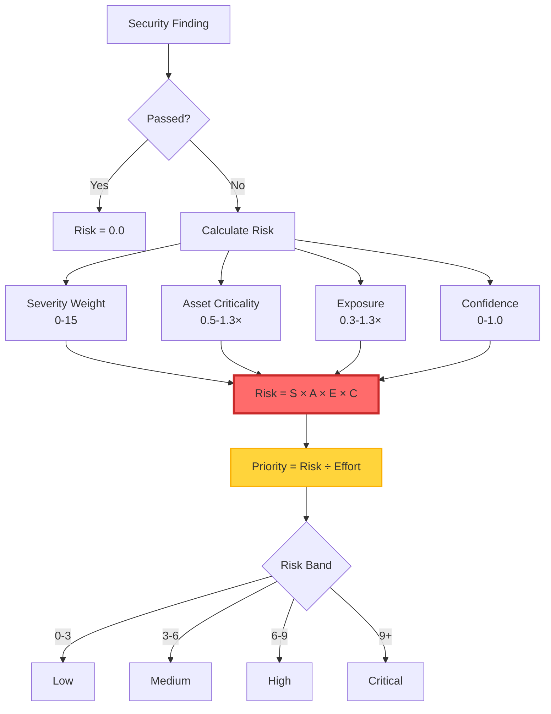

### Severity Weights

| Severity | Weight | Examples |
|----------|--------|----------|
| **Critical** | 15.0 | Root access, RCE, complete compromise |
| **High** | 10.0 | Privilege escalation, data exposure |
| **Medium** | 5.0 | Information disclosure, DoS |
| **Low** | 2.0 | Best practice violations |
| **Info** | 0.0 | Recommendations |

### Asset Criticality Multipliers

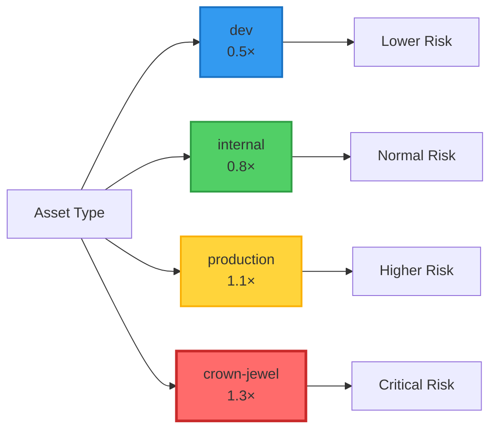

### Contextual Risk Example

Same vulnerability (SSH root login enabled):

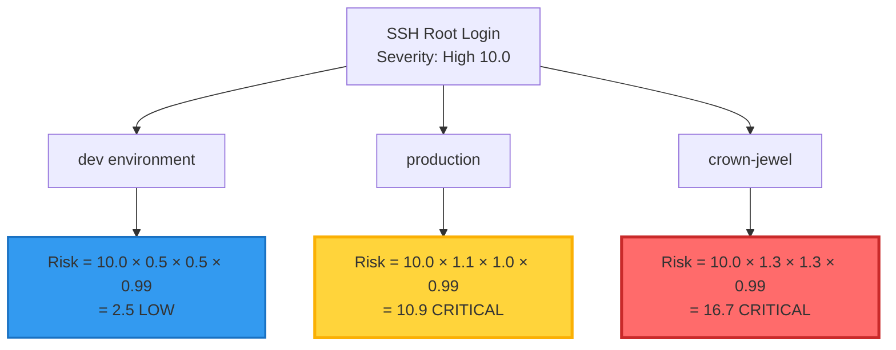

**Key Insight:** The same misconfiguration has different business impact depending on context!

---

## Usage Flows

### System Scanning Workflow

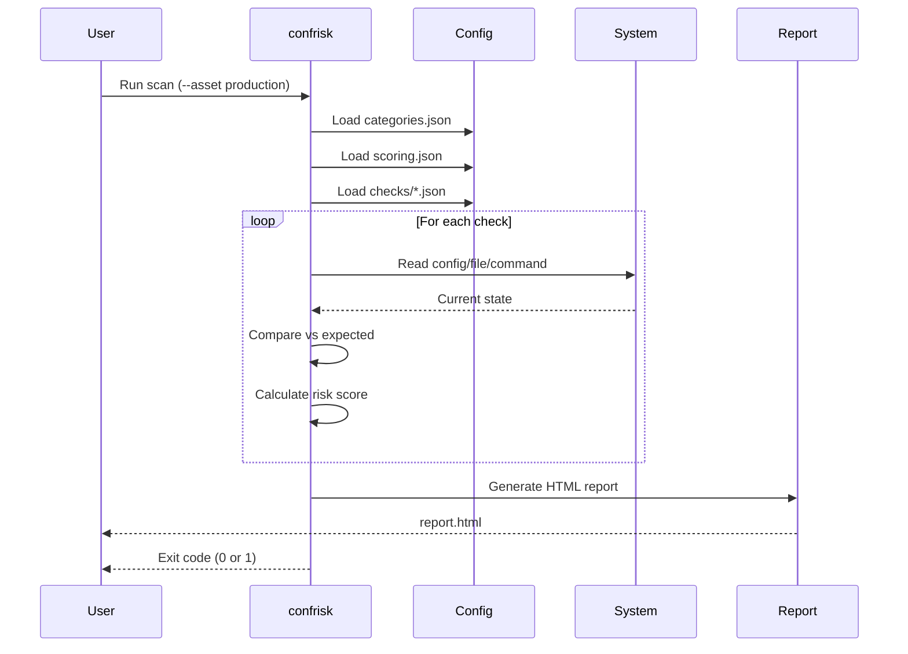

### NPM Scanning with Git Hooks

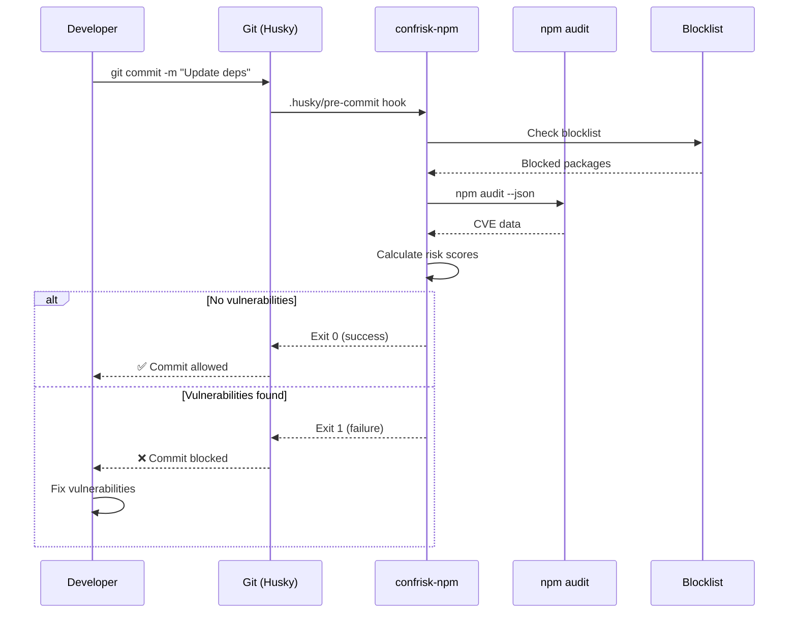

### CI/CD Integration Flow

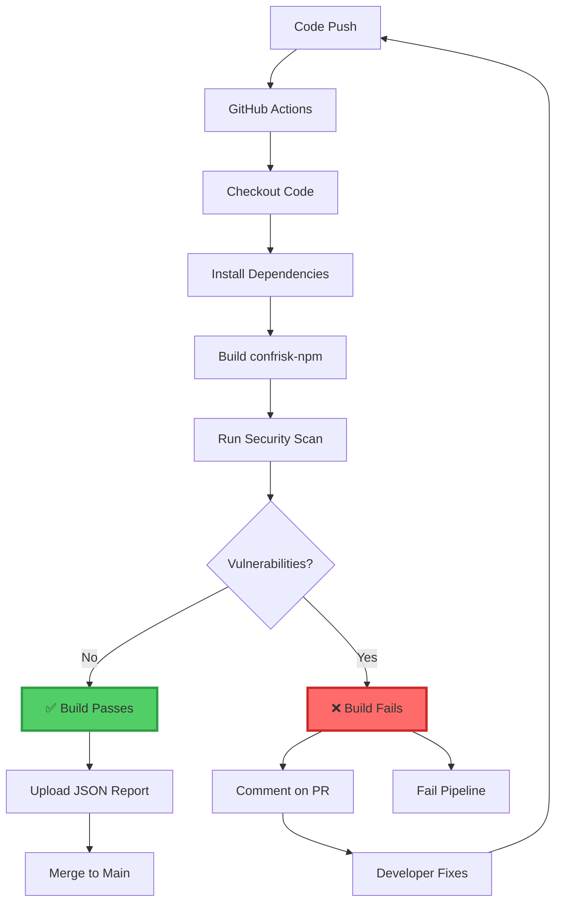

---

## Config-Driven Architecture

### Detection Types

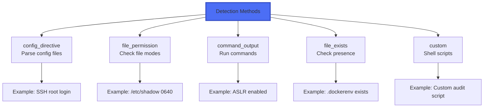

### Adding New Security Checks

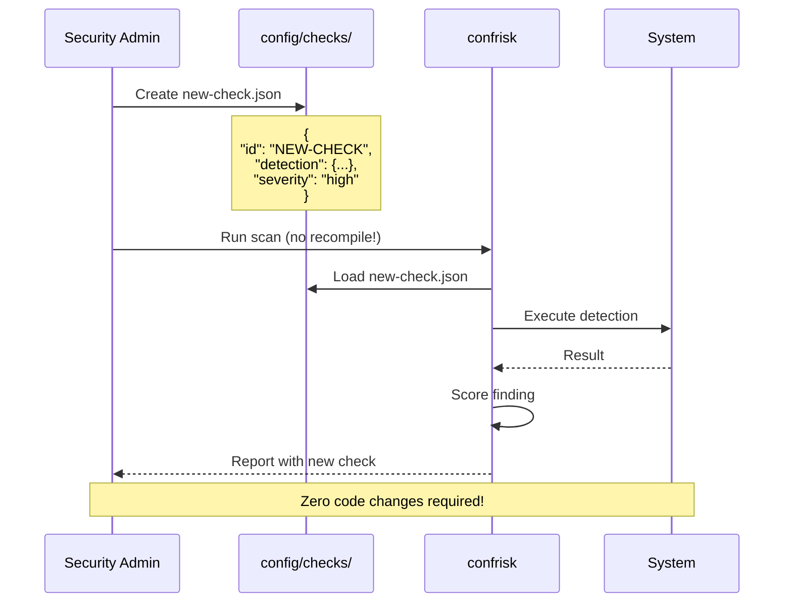

---

## Security Categories

### 12 Issue Categories

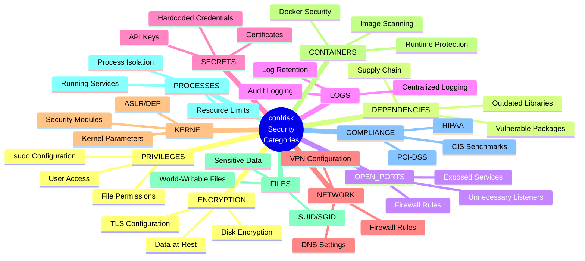

---

## Integration Ecosystem

### External Scanner Integration

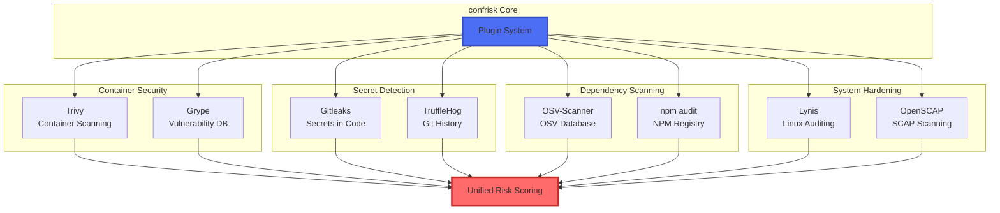

---

## Deployment Scenarios

### Multi-Environment Setup

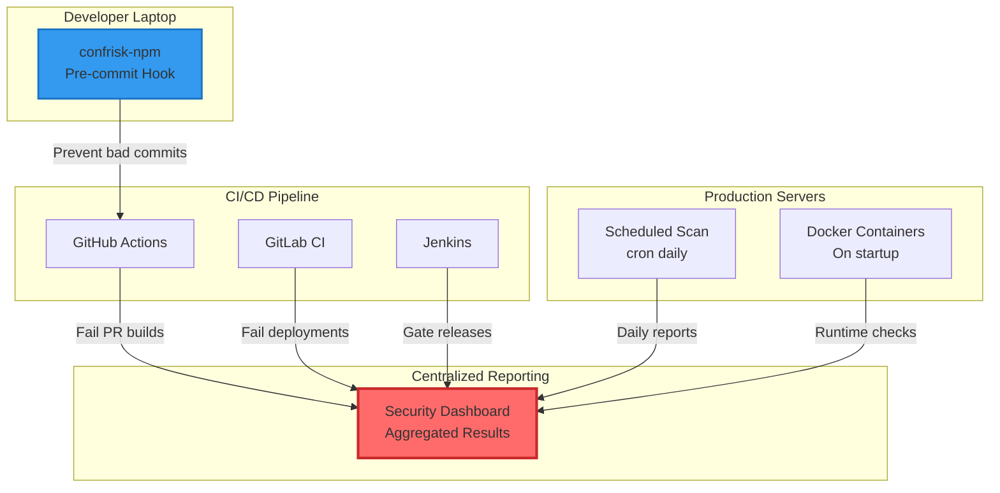

---

## Current Features (v0.2.0)

### ✅ Implemented

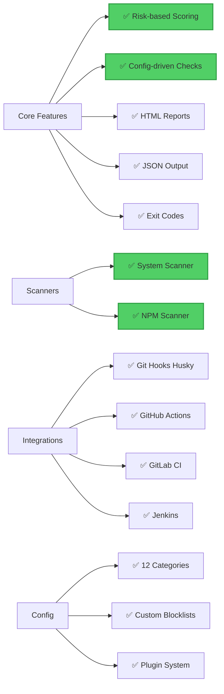

### Feature Comparison

| Feature | confrisk | Traditional Scanners |
|---------|----------|---------------------|
| **Contextual Risk** | ✅ Yes | ❌ No |
| **Config-Driven** | ✅ Yes | ❌ Hardcoded |
| **Multi-Scanner** | ✅ System + NPM | ❌ Single focus |
| **Git Hooks** | ✅ Built-in | ⚠️ Manual setup |
| **Explainable Scores** | ✅ Full breakdown | ❌ Severity only |
| **Zero Dependencies** | ✅ Static binary | ❌ Many deps |
| **Priority Calculation** | ✅ Risk ÷ Effort | ❌ No prioritization |
| **Asset Profiles** | ✅ 4 profiles | ❌ One-size-fits-all |

---

## Future Roadmap

### Phase 1: Enhanced Scanners (Q3 2026)

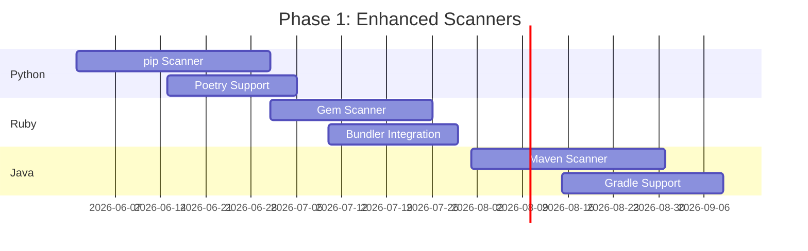

#### New Scanners

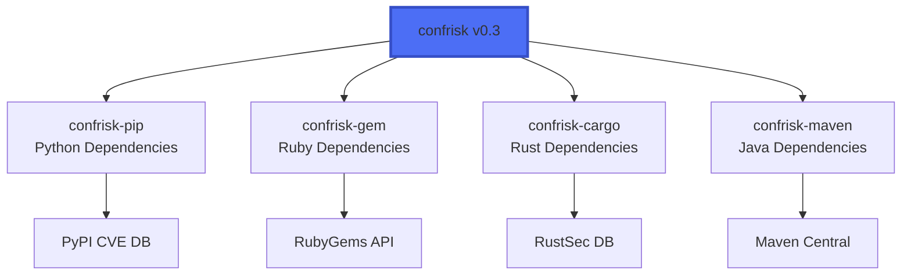

### Phase 2: Advanced Features (Q4 2026)

#### Auto-Fix Engine

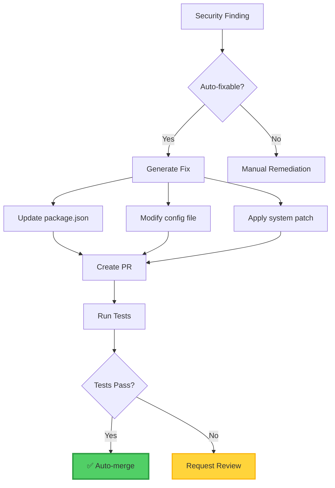

#### Dependency Graph Visualization

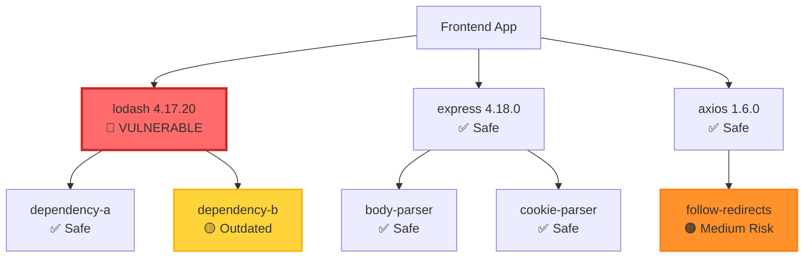

### Phase 3: Enterprise Features (Q1 2027)

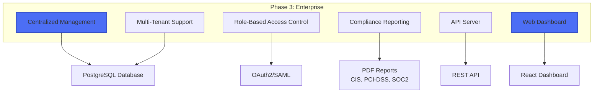

### Phase 4: AI/ML Integration (Q2 2027)

#### ML-Powered Risk Prediction

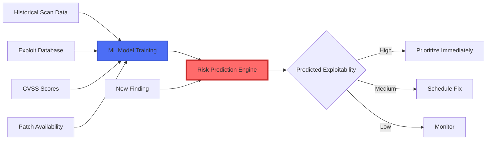

#### AI-Generated Remediation

```mermaid
sequenceDiagram
    participant Dev
    participant confrisk
    participant AI as GPT-4 / Claude
    participant GitHub

    confrisk->>AI: Finding: "SSH root login enabled"
    Note over AI: Analyze context<br/>Review codebase<br/>Generate fix
    AI-->>confrisk: Remediation steps + code
    confrisk->>GitHub: Create PR with fix
    GitHub-->>Dev: Review PR
    Dev->>GitHub: Approve & Merge
```

---

## Roadmap Timeline

### 2026-2027 Development Plan

```mermaid
gantt
    title confrisk Development Roadmap
    dateFormat  YYYY-MM
    section v0.3
    Python Scanner        :2026-06, 2M
    Ruby Scanner          :2026-07, 2M
    Java Scanner          :2026-08, 2M
    section v0.4
    Auto-Fix Engine       :2026-09, 2M
    Dependency Graph      :2026-10, 1M
    SARIF Format          :2026-11, 1M
    section v0.5
    Web Dashboard         :2026-12, 3M
    API Server            :2027-01, 2M
    Multi-Tenant          :2027-02, 2M
    section v1.0
    ML Risk Prediction    :2027-03, 3M
    AI Remediation        :2027-04, 2M
    Enterprise Features   :2027-05, 3M
```

---

## Proposed Improvements

### Near-Term (3-6 months)

#### 1. Additional Package Managers

**Priority:** High
**Effort:** Medium

```mermaid
graph LR
    A[confrisk-pip] --> B[requirements.txt]
    A --> C[Pipfile]
    A --> D[poetry.lock]

    E[confrisk-gem] --> F[Gemfile]
    E --> G[Gemfile.lock]

    H[confrisk-cargo] --> I[Cargo.toml]
    H --> J[Cargo.lock]

    style A fill:#4c6ef5,stroke:#364fc7,stroke-width:2px
    style E fill:#4c6ef5,stroke:#364fc7,stroke-width:2px
    style H fill:#4c6ef5,stroke:#364fc7,stroke-width:2px
```

#### 2. SARIF Output Format

**Priority:** High
**Effort:** Low

Integrate with GitHub Security tab:

```json
{
  "version": "2.1.0",
  "$schema": "https://json.schemastore.org/sarif-2.1.0.json",
  "runs": [{
    "tool": {
      "driver": {
        "name": "confrisk",
        "version": "0.2.0"
      }
    },
    "results": [
      {
        "ruleId": "NPM-BLOCKED-LODASH",
        "level": "error",
        "message": {
          "text": "Vulnerable lodash version detected"
        },
        "locations": [{
          "physicalLocation": {
            "artifactLocation": {
              "uri": "package.json"
            }
          }
        }]
      }
    ]
  }]
}
```

#### 3. HTML Report Enhancements

**Priority:** Medium
**Effort:** Low

```mermaid
graph TD
    A[Enhanced HTML Report] --> B[📊 Charts & Graphs]
    A --> C[🔗 Dependency Graph]
    A --> D[📈 Trend Analysis]
    A --> E[🎨 Custom Themes]

    B --> F[Risk Distribution Chart]
    B --> G[Category Breakdown]

    C --> H[Interactive D3.js Visualization]

    D --> I[Historical Comparison]
    D --> J[Fix Rate Tracking]

    style A fill:#4c6ef5,stroke:#364fc7,stroke-width:3px
```

### Mid-Term (6-12 months)

#### 4. Web Dashboard

**Priority:** High
**Effort:** High

```mermaid
graph TB
    subgraph "Frontend - React"
        A[Dashboard Overview]
        B[Project List]
        C[Scan History]
        D[Finding Details]
        E[Reports]
    end

    subgraph "Backend - Rust API"
        F[REST API]
        G[WebSocket]
        H[Database]
    end

    A --> F
    B --> F
    C --> F
    D --> F
    E --> F

    F --> H
    G --> H

    H --> I[(PostgreSQL)]

    style A fill:#4c6ef5,stroke:#364fc7,stroke-width:2px
    style F fill:#ff6b6b,stroke:#c92a2a,stroke-width:2px
```

#### 5. Continuous Monitoring

**Priority:** High
**Effort:** Medium

```mermaid
sequenceDiagram
    participant Server
    participant Agent as confrisk-agent
    participant Central as Central Server
    participant Alert as Alerting

    loop Every Hour
        Agent->>Server: Scan system
        Server-->>Agent: Findings
        Agent->>Central: Upload results

        Central->>Central: Compare vs baseline

        alt New Vulnerabilities
            Central->>Alert: Send alert
            Alert->>Alert: PagerDuty/Slack/Email
        end
    end
```

#### 6. Policy Engine

**Priority:** Medium
**Effort:** Medium

```yaml
# policy.yaml
policies:
  - name: "Production Compliance"
    rules:
      - category: "PRIVILEGES"
        severity: "high"
        action: "fail"

      - category: "DEPENDENCIES"
        severity: "critical"
        action: "fail"

      - category: "OPEN_PORTS"
        patterns:
          - port: 22
            exposure: "internet-facing"
            action: "fail"

    exceptions:
      - finding_id: "SSH-ROOT-LOGIN"
        expires: "2026-12-31"
        reason: "Approved by security team"
        approved_by: "security@company.com"
```

### Long-Term (12+ months)

#### 7. AI-Powered Features

```mermaid
graph TB
    A[AI Integration] --> B[GPT-4 API]
    A --> C[Claude API]

    B --> D[Code Analysis]
    B --> E[Remediation Suggestions]
    B --> F[Security Q&A]

    C --> G[Policy Generation]
    C --> H[Risk Explanation]
    C --> I[Documentation]

    D --> J[Auto-generated Fixes]
    E --> J
    G --> K[Custom Checks]
    H --> L[Explainable AI]

    style A fill:#4c6ef5,stroke:#364fc7,stroke-width:3px
    style J fill:#51cf66,stroke:#2f9e44,stroke-width:2px
```

#### 8. Compliance Automation

```mermaid
graph LR
    A[Compliance Framework] --> B[CIS Benchmarks]
    A --> C[PCI-DSS]
    A --> D[HIPAA]
    A --> E[SOC 2]
    A --> F[ISO 27001]

    B --> G[Auto-generate Evidence]
    C --> G
    D --> G
    E --> G
    F --> G

    G --> H[Audit Reports]
    G --> I[Control Mapping]
    G --> J[Gap Analysis]

    style A fill:#4c6ef5,stroke:#364fc7,stroke-width:3px
    style G fill:#51cf66,stroke:#2f9e44,stroke-width:2px
```

---

## Performance Metrics

### Current Performance

```mermaid
graph LR
    A[Scan Performance] --> B[System Scan<br/>~100ms]
    A --> C[NPM Scan<br/>~500ms]
    A --> D[Report Gen<br/>~50ms]

    E[Binary Size] --> F[confrisk<br/>2.4MB]
    E --> G[confrisk-npm<br/>2.4MB]

    H[Memory Usage] --> I[Peak: ~50MB]
    H --> J[Average: ~20MB]

    style B fill:#51cf66,stroke:#2f9e44,stroke-width:2px
    style C fill:#51cf66,stroke:#2f9e44,stroke-width:2px
```

### Scalability Goals

| Metric | Current | Target (v1.0) |
|--------|---------|---------------|
| **Scan Time** | 100ms | 50ms |
| **Memory Usage** | 50MB | 30MB |
| **Binary Size** | 2.4MB | 2.0MB |
| **Checks/Second** | 100 | 500 |
| **Concurrent Scans** | 1 | 10 |

---

## Distribution Strategy

### Package Manager Availability

```mermaid
graph TB
    subgraph "Current"
        A[GitHub Releases]
        B[cargo install]
    end

    subgraph "Q3 2026"
        C[Ubuntu PPA]
        D[Arch AUR]
        E[Snapcraft]
    end

    subgraph "Q4 2026"
        F[Fedora COPR]
        G[Homebrew]
        H[Docker Hub]
    end

    subgraph "Q1 2027"
        I[Official Debian]
        J[Official Ubuntu]
        K[Official Fedora]
    end

    style A fill:#51cf66,stroke:#2f9e44,stroke-width:2px
    style B fill:#51cf66,stroke:#2f9e44,stroke-width:2px
```

---

## Success Metrics

### Adoption Targets

```mermaid
graph LR
    A[Success Metrics] --> B[GitHub Stars<br/>Target: 1000]
    A --> C[Downloads<br/>Target: 10K/month]
    A --> D[Contributors<br/>Target: 20]
    A --> E[Enterprise Users<br/>Target: 50]

    style A fill:#4c6ef5,stroke:#364fc7,stroke-width:3px
```

### Quality Metrics

| Metric | Target |
|--------|--------|
| **Test Coverage** | > 80% |
| **Documentation Coverage** | 100% |
| **False Positive Rate** | < 5% |
| **Scan Speed** | < 1s for medium project |
| **Memory Efficiency** | < 100MB peak |

---

## Conclusion

### Key Achievements

✅ **Production-ready** risk-based security scanner
✅ **Config-driven** architecture (no code changes for new checks)
✅ **Multi-scanner** system (Linux + npm, more coming)
✅ **Git hooks** integration (prevent vulnerable commits)
✅ **Comprehensive** documentation (10,000+ lines)

### Next Steps

**Immediate (Month 1):**
- Publish to package repositories
- Create demo videos
- Write blog posts
- Present at conferences

**Short-term (Months 2-6):**
- Add Python/Ruby/Java scanners
- Implement auto-fix engine
- Create web dashboard
- Build community

**Long-term (Year 1+):**
- Enterprise features
- AI integration
- Compliance automation
- Global adoption

---

**Report Version:** 1.0
**Generated:** May 24, 2026
**Status:** Production Ready
**License:** MIT

**Contact:** https://github.com/yourusername/confrisk
