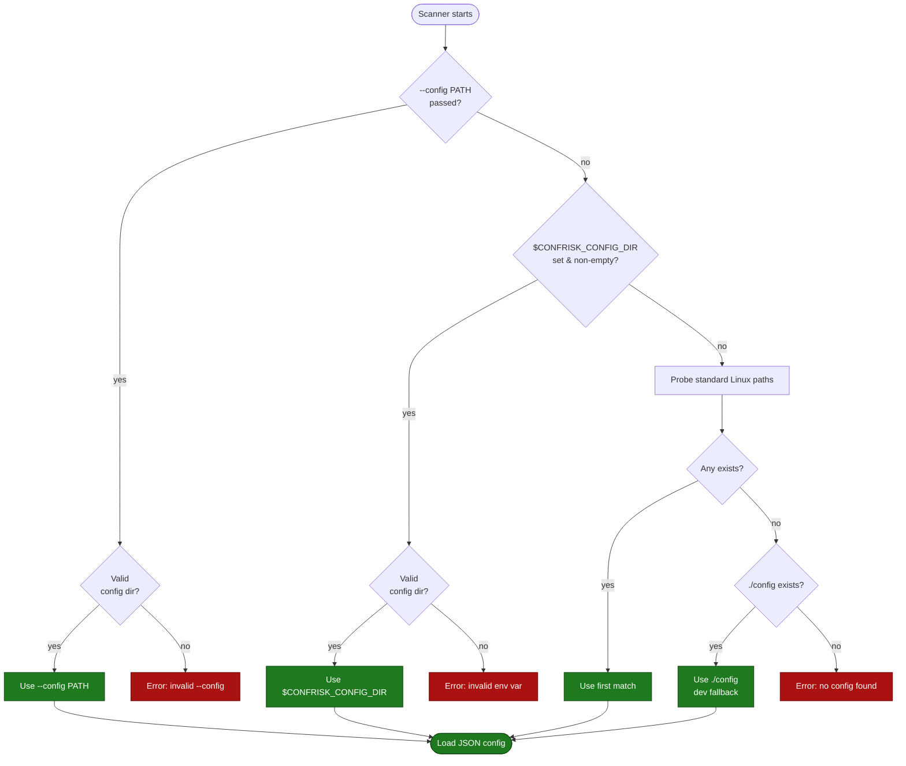
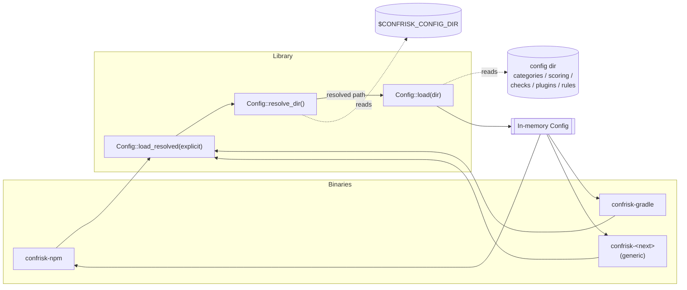
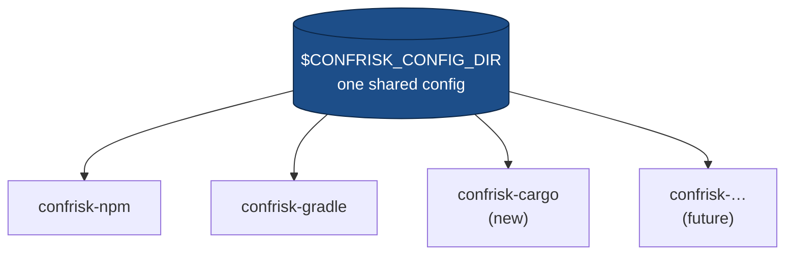

# Configuration Location & `CONFRISK_CONFIG_DIR`

All confrisk scanners — `confrisk-npm`, `confrisk-gradle`, and any future
ecosystem scanner — read their rules, checks, plugins and scoring from a single
JSON **config directory**. Where that directory lives is controlled by one
environment variable:

```sh
export CONFRISK_CONFIG_DIR=/etc/confrisk
```

Set it once and every scanner picks it up. No per-tool configuration, no
hardcoded paths baked into the binary.

> **Platform:** the standard fallback paths below are tuned for **Linux**. The
> `CONFRISK_CONFIG_DIR` variable and the `--config` flag work on any platform,
> so the same mechanism extends cleanly to other OSes later.

---

## What lives in the config directory

The directory is a self-contained tree of JSON. `categories.json` at its root
is the **marker file** the resolver uses to recognise a valid config directory.

```
$CONFRISK_CONFIG_DIR/
├── categories.json        # marker file — its presence validates the directory
├── scoring.json           # risk/priority scoring model
├── checks/                # individual security checks (one JSON per check)
│   ├── ssh-root-login.json
│   └── shadow-permissions.json
├── plugins/               # external scanner integrations (trivy, osv, …)
│   ├── trivy.json
│   └── osv-scanner.json
└── rules/
    ├── dependencies.json  # blocked-package rules (npm, gradle, …)
    └── ports.json         # dangerous-port rules
```

The **same** `rules/dependencies.json` drives both the npm and gradle blocklists
(entries are tagged by `ecosystem`), which is exactly why pointing every scanner
at one directory matters.

---

## Resolution order

When a scanner starts it calls `Config::resolve_dir(...)`, which walks the
following sources and uses the **first match**:



### Priority table

| # | Source                              | Validated? | Notes                                            |
|---|-------------------------------------|------------|--------------------------------------------------|
| 1 | `--config <PATH>` CLI flag          | strict     | Explicit override; errors if invalid (catch typos)|
| 2 | `$CONFRISK_CONFIG_DIR`              | strict     | **Canonical mechanism** for production/CI         |
| 3 | `$XDG_CONFIG_HOME/confrisk`         | probed     | Skipped if `XDG_CONFIG_HOME` unset                |
| 4 | `$HOME/.config/confrisk`            | probed     | Per-user install                                  |
| 5 | `/etc/confrisk`                     | probed     | System-wide install                               |
| 6 | `/usr/local/share/confrisk/config`  | probed     | Local package install                             |
| 7 | `/usr/share/confrisk/config`        | probed     | Distro package install                            |
| 8 | `./config`                          | probed     | Development fallback (repo checkout)              |

- **strict** = the path is used as-is; if it is not a valid config directory the
  scanner fails loudly with a helpful message (rather than silently falling
  through). This makes misconfiguration obvious.
- **probed** = tried only if it exists and contains the marker file; otherwise
  the resolver moves on to the next candidate.

---

## How scanners consume it

Every binary funnels through the same library entry point, so behaviour is
identical across ecosystems. Adding a new scanner is just a matter of calling
`Config::load_resolved(...)` — the location logic comes for free.



In code (`src/bin/confrisk-npm.rs`, `src/bin/confrisk-gradle.rs`):

```rust
// `config_path` is Some(...) only when --config was passed; otherwise None,
// which lets resolve_dir() fall through to $CONFRISK_CONFIG_DIR and the
// standard locations.
let config = Config::load_resolved(config_path.as_deref())?;
```

---

## Usage examples

### Production / CI — set it once

```sh
# Point all scanners at the system config
export CONFRISK_CONFIG_DIR=/etc/confrisk

confrisk-npm    --path ./my-node-app   --fail-on high --exit-code
confrisk-gradle --path ./my-java-app   --fail-on high --exit-code
```

### Per-invocation override

```sh
# --config always wins over the environment variable
confrisk-npm --path . --config /opt/confrisk/custom-rules
```

### Local development (repo checkout)

```sh
# Run from the confrisk/ directory; ./config is the dev fallback
cd confrisk
cargo run --bin confrisk-npm -- --path ../some-project
```

### GitHub Actions

```yaml
env:
  CONFRISK_CONFIG_DIR: ${{ github.workspace }}/confrisk/config
steps:
  - run: confrisk-npm --path . --fail-on high --exit-code
```

---

## Code structure (shared modules)

The scanners share almost everything; only the per-ecosystem parsing differs.

| Module              | Responsibility                                                        |
|---------------------|----------------------------------------------------------------------|
| `config.rs`         | Load JSON config; **resolve** the config directory (env var + paths). |
| `scanner.rs`        | The `Scanner` trait — the one contract a new ecosystem implements.    |
| `cli.rs`            | Shared CLI driver: arg parsing, config resolution, rendering, exit codes. |
| `model.rs`          | `Finding`, scoring, risk bands — ecosystem-independent.               |
| `npm.rs` / `gradle.rs` | Ecosystem-specific `Scanner` implementations.                     |
| `bin/confrisk-*.rs` | Thin entry points — wire one scanner into `cli::run`.                 |

Each binary is just:

```rust
use confrisk::cli::{run, ToolInfo};
use confrisk::npm::NpmScanner;

fn main() {
    run(ToolInfo::NPM, NpmScanner::new);
}
```

`cli::run` parses arguments, calls `Config::load_resolved(...)`, builds the
scanner, scores findings, renders text/JSON, and sets the CI exit code — so none
of that is duplicated per ecosystem.

## Adding a new ecosystem scanner (generic setup)

The location mechanism *and* the CLI plumbing are ecosystem-agnostic. To add,
say, a `confrisk-cargo` scanner:

1. Create `src/cargo.rs` with a struct that implements the `Scanner` trait:
   ```rust
   use confrisk::scanner::Scanner;
   use confrisk::model::Finding;

   pub struct CargoScanner { /* config, project_path */ }
   impl Scanner for CargoScanner {
       fn scan(&self) -> Vec<Finding> { /* parse Cargo.lock, check blocklist */ vec![] }
   }
   ```
2. Add a `ToolInfo::CARGO` constant in `cli.rs` and a thin binary
   `src/bin/confrisk-cargo.rs`:
   ```rust
   fn main() { confrisk::cli::run(ToolInfo::CARGO, CargoScanner::new); }
   ```
3. Add blocklist entries tagged with your `ecosystem` in
   `rules/dependencies.json` inside the config directory.

No changes to the resolver or CLI logic are required — the new binary
automatically honours `CONFRISK_CONFIG_DIR`, the `--config` flag, every fallback
path, and gets text/JSON output plus CI exit codes for free.



---

## Troubleshooting

| Symptom                                                       | Cause / fix                                                                 |
|--------------------------------------------------------------|----------------------------------------------------------------------------|
| `could not locate a confrisk config directory`              | No source matched. Set `CONFRISK_CONFIG_DIR`, or run from a dir with `./config`. |
| `CONFRISK_CONFIG_DIR='...' does not contain categories.json` | The variable points at the wrong directory. Point it at the dir that holds `categories.json`. |
| `config directory '...' (from --config) does not contain …`  | The `--config` path is wrong. Same fix as above.                           |
| Scanner reads stale rules                                    | Two configs on disk; check `echo $CONFRISK_CONFIG_DIR` to see which is active. |

Verify which directory is in effect:

```sh
echo "$CONFRISK_CONFIG_DIR"
ls "$CONFRISK_CONFIG_DIR/categories.json"
```
