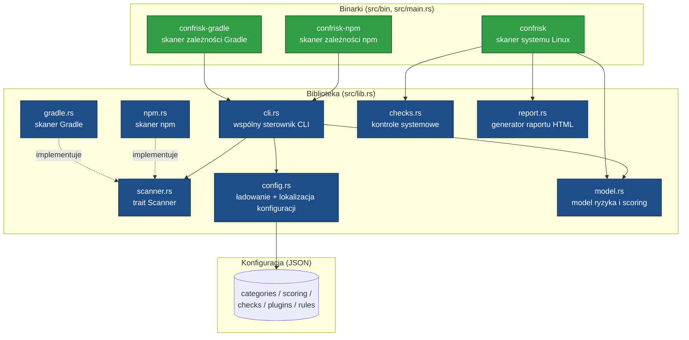
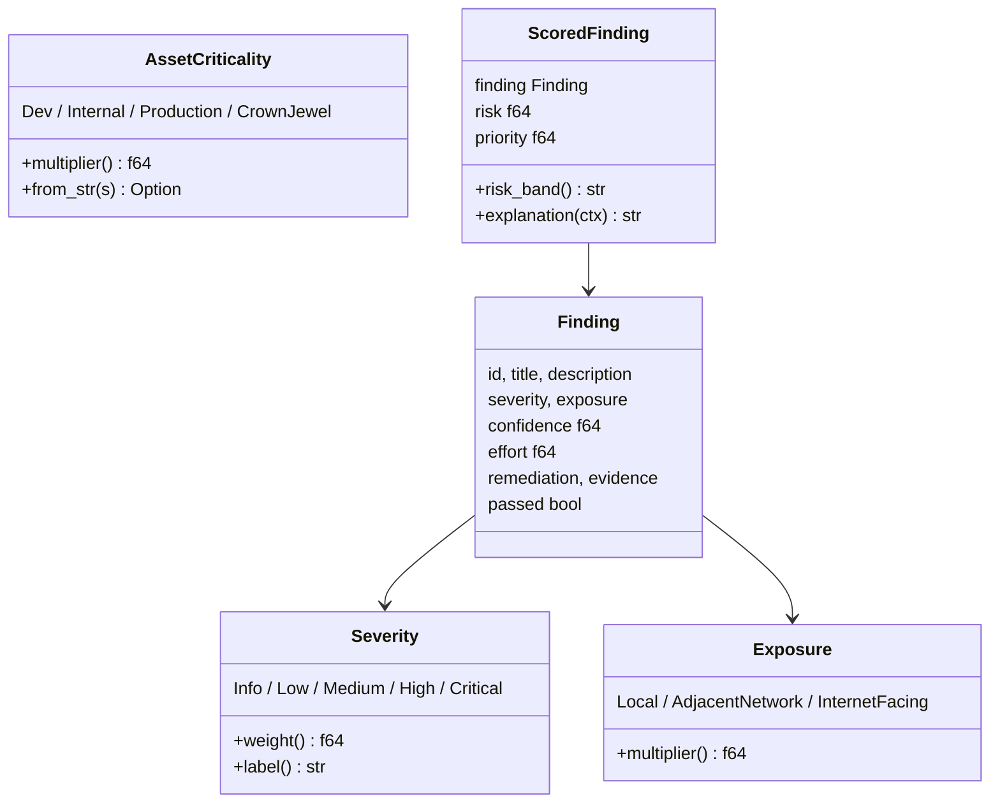
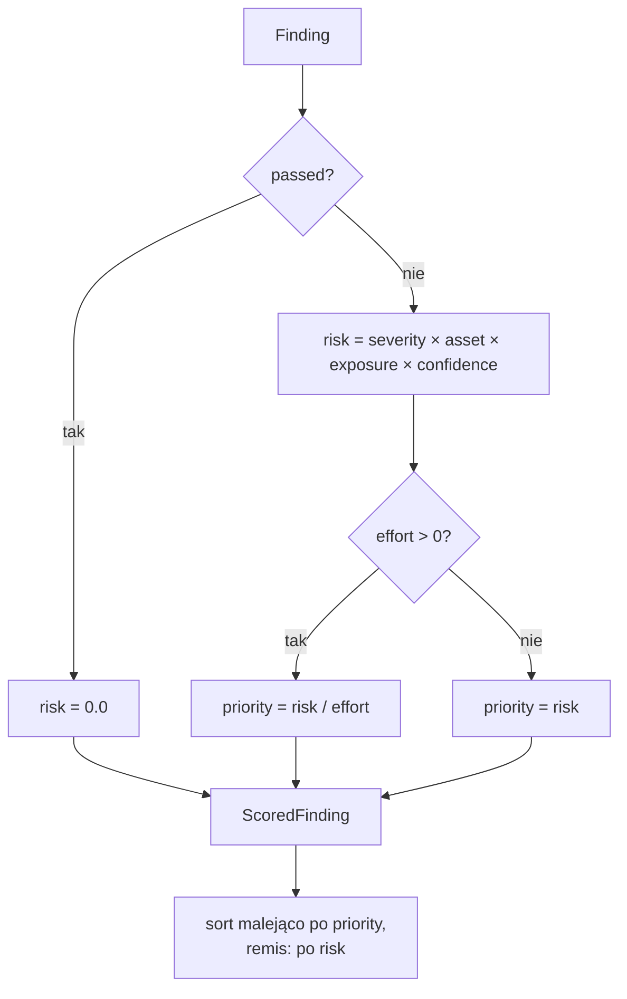
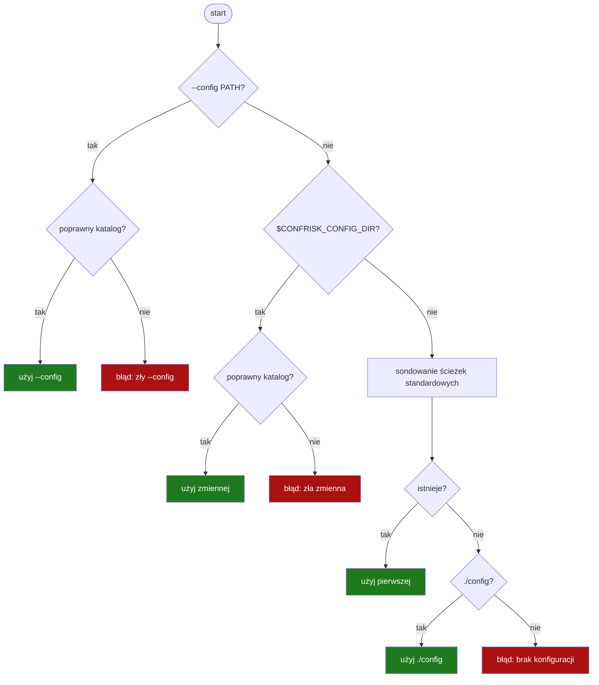
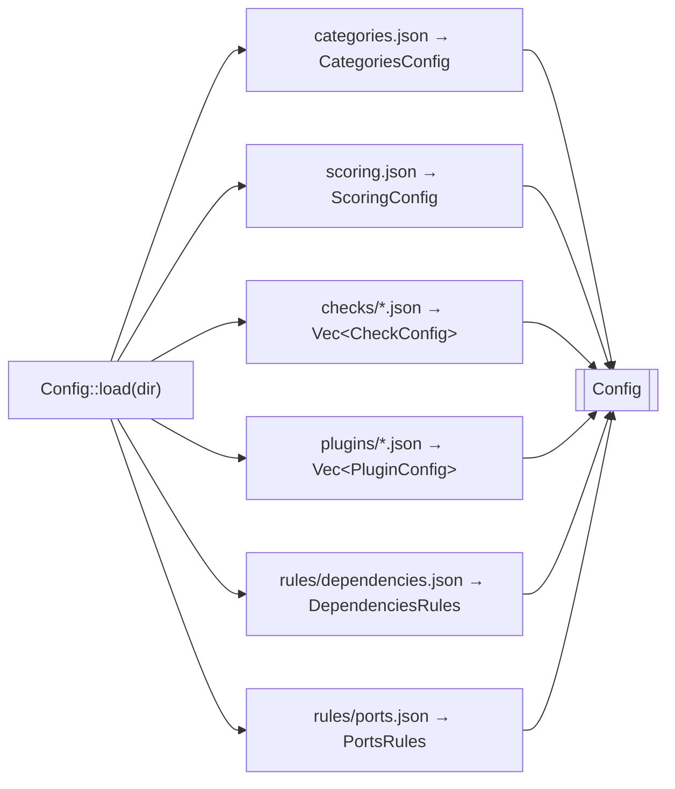
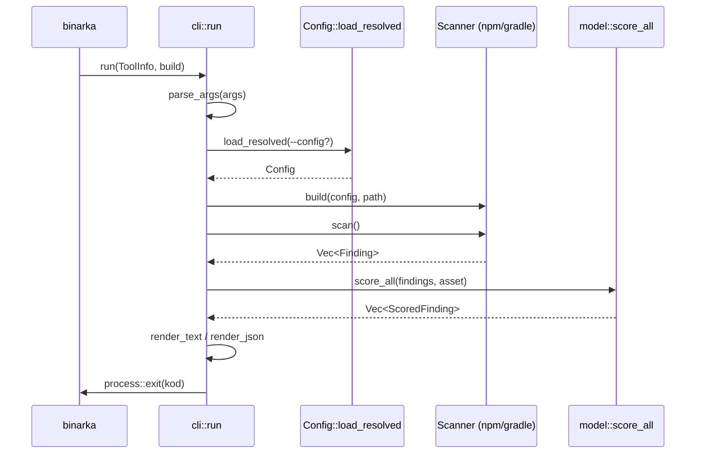
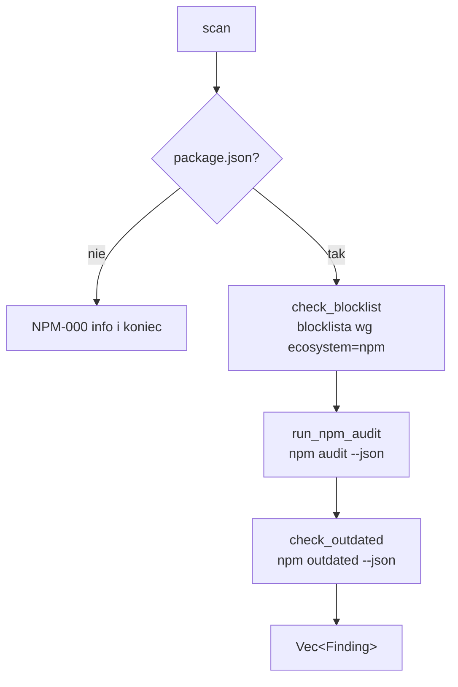
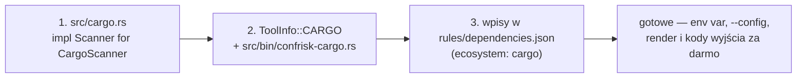
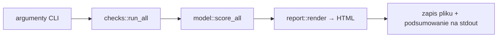
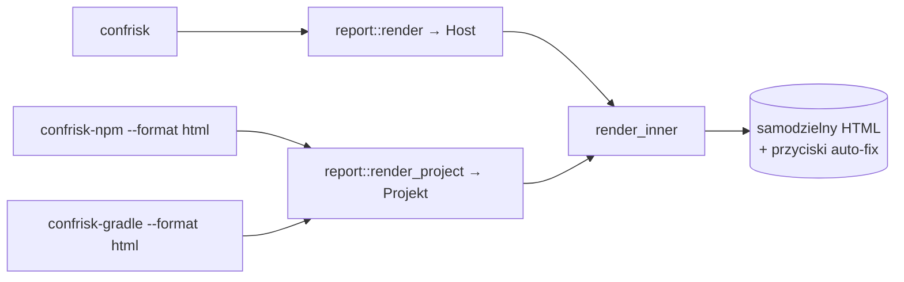

# Dokumentacja kodu — confrisk

**Wersja:** 0.2.0
**Język implementacji:** Rust (edycja 2021)
**Zależności runtime:** `serde`, `serde_json`, `regex`

Dokument opisuje strukturę kodu źródłowego frameworka **confrisk** — moduł po module,
wraz z kluczowymi typami danych, funkcjami i przepływem sterowania. Wartości liczbowe
(wagi, mnożniki, progi) podano zgodnie z aktualnym stanem kodu w `src/model.rs`.

---

## 1. Architektura wysokopoziomowa

confrisk składa się z **biblioteki** (`lib.rs`) oraz **trzech plików wykonywalnych**
(binarek). Logika współdzielona żyje w bibliotece; binarki są cienkimi punktami wejścia.



### Mapa odpowiedzialności modułów

| Moduł | Plik | Odpowiedzialność |
|-------|------|------------------|
| `config` | `src/config.rs` | Deserializacja JSON; **lokalizacja** katalogu konfiguracji (zmienna `CONFRISK_CONFIG_DIR` + ścieżki standardowe). |
| `scanner` | `src/scanner.rs` | Trait `Scanner` — jedyny kontrakt, który implementuje nowy ekosystem. |
| `cli` | `src/cli.rs` | Wspólny sterownik: parsowanie argumentów, ładowanie konfiguracji, render tekst/JSON, kody wyjścia. |
| `model` | `src/model.rs` | Typy `Finding`/`ScoredFinding`, scoring ryzyka i priorytetu, pasma ryzyka. |
| `npm` | `src/npm.rs` | Implementacja `Scanner` dla npm (blocklist, `npm audit`, pakiety nieaktualne). |
| `gradle` | `src/gradle.rs` | Implementacja `Scanner` dla Gradle (parsowanie `build.gradle`/`.kts`). |
| `checks` | `src/checks.rs` | Wbudowane kontrole konfiguracji systemu Linux. |
| `report` | `src/report.rs` | Generowanie raportu HTML (wspólne dla wszystkich skanerów) + przyciski auto-fix. |
| binarki | `src/main.rs`, `src/bin/*` | Punkty wejścia procesów. |

---

## 2. Moduł `model` — model ryzyka

Plik: `src/model.rs`. Moduł niezależny od ekosystemu — definiuje wspólny język wyników.

### 2.1 Typy wyliczeniowe i wagi



**Wagi `Severity::weight()`** — `Info`=1.0, `Low`=3.0, `Medium`=5.5, `High`=8.0, `Critical`=10.0.

**Mnożniki `AssetCriticality::multiplier()`** — `Dev`=0.5, `Internal`=0.8, `Production`=1.1, `CrownJewel`=1.3.

**Mnożniki `Exposure::multiplier()`** — `Local`=0.7, `AdjacentNetwork`=0.95, `InternetFacing`=1.25.

### 2.2 Struktura `Finding`

Surowy wynik pojedynczej kontroli — to, *co* wykryto, jeszcze bez oceny ryzyka:

| Pole | Typ | Znaczenie |
|------|-----|-----------|
| `id` | `String` | Unikalny identyfikator (np. `NPM-AUDIT-LODASH`). |
| `title`, `description` | `String` | Tytuł i opis. |
| `severity` | `Severity` | Dotkliwość bazowa. |
| `exposure` | `Exposure` | Poziom ekspozycji. |
| `confidence` | `f64` (0.0–1.0) | Pewność detekcji. |
| `effort` | `f64` (1.0–5.0) | Szacowany nakład naprawy. |
| `remediation`, `evidence` | `String` | Sposób naprawy i dowód. |
| `passed` | `bool` | `true` = kontrola zaliczona (ryzyko 0). |

### 2.3 Funkcja `score_all` — scoring i sortowanie



**Wzory:**

```
risk     = severity.weight() × asset.multiplier() × exposure.multiplier() × confidence
priority = risk / effort        (gdy effort > 0, w przeciwnym razie priority = risk)
```

**Pasma ryzyka — `ScoredFinding::risk_band()`:**

| Pasmo | Warunek |
|-------|---------|
| `critical` | `risk ≥ 9.0` |
| `high` | `risk ≥ 6.0` |
| `medium` | `risk ≥ 3.5` |
| `low` | `risk ≥ 1.5` |
| `info` | poniżej 1.5 |

Metoda `explanation(ctx)` zwraca czytelny rozbiór obliczeń (objaśnialny scoring).

---

## 3. Moduł `config` — konfiguracja i jej lokalizacja

Plik: `src/config.rs`. Dwie odpowiedzialności: (1) **gdzie** leży konfiguracja oraz
(2) **jak** ją zdeserializować.

### 3.1 Lokalizacja katalogu — `Config::resolve_dir`

Jedno źródło prawdy o lokalizacji: zmienna środowiskowa `CONFRISK_CONFIG_DIR`
(stała `CONFIG_DIR_ENV`). Katalog uznaje się za poprawny, jeśli zawiera plik-marker
`categories.json` (stała `CONFIG_MARKER`).



**Kolejność rozstrzygania (pierwsze trafienie wygrywa):**

1. `--config <PATH>` (flaga CLI) — walidacja ścisła (literówka = błąd).
2. `$CONFRISK_CONFIG_DIR` — walidacja ścisła.
3. Ścieżki standardowe (Linux), sondowane po kolei: `$XDG_CONFIG_HOME/confrisk`,
   `$HOME/.config/confrisk`, `/etc/confrisk`, `/usr/local/share/confrisk/config`,
   `/usr/share/confrisk/config`.
4. `./config` — fałszywka deweloperska (uruchomienie z repo).

**Kluczowe API:**

| Funkcja | Sygnatura | Rola |
|---------|-----------|------|
| `resolve_dir` | `fn(Option<&str>) -> Result<String, String>` | Rozstrzyga ścieżkę katalogu. |
| `load_resolved` | `fn(Option<&str>) -> Result<Config, String>` | `resolve_dir` + `load`. Punkt wejścia binarek. |
| `load` | `fn(&str) -> Result<Config, String>` | Ładuje wszystkie pliki JSON z katalogu. |
| `is_config_dir` | `fn(P) -> bool` | Czy katalog zawiera marker. |
| `standard_dirs` | `fn() -> Vec<PathBuf>` | Lista ścieżek standardowych. |

### 3.2 Struktura `Config` i deserializacja

`Config::load` składa w całość poniższe sekcje (każda z osobnego pliku/katalogu JSON):



Wczytywanie pojedynczego pliku realizuje generyczna funkcja pomocnicza
`load_json<T: DeserializeOwned>(path) -> Result<T, String>` (czytelne komunikaty błędów
z nazwą pliku). Kontrole z `enabled=false` są pomijane już na etapie ładowania.

Najważniejsze typy konfiguracji: `CheckConfig` (z polimorficznym `Detection` — wariant
zależny od pola `type`), `PluginConfig` (integracja zewnętrznych skanerów),
`BlockedPackage` (wpis blocklisty z polem `ecosystem`), `PortRule`.

---

## 4. Moduł `scanner` — wspólny kontrakt

Plik: `src/scanner.rs`. Definiuje jeden trait:

```rust
pub trait Scanner {
    fn scan(&self) -> Vec<Finding>;
}
```

To **jedyny** kontrakt, który musi spełnić nowy ekosystem, by wpiąć się we wspólny
sterownik CLI. Scoring i prioretyzacja są nakładane później (w `cli`/`model`), więc
implementacja opisuje wyłącznie *co* znaleziono.

---

## 5. Moduł `cli` — wspólny sterownik binarek

Plik: `src/cli.rs`. Skupia całą logikę współdzieloną przez `confrisk-npm`
i `confrisk-gradle`, dzięki czemu każda binarka to kilkanaście linii.



### Kluczowe elementy

| Element | Rola |
|---------|------|
| `ToolInfo` | Statyczne metadane binarki (nazwa, tytuł, rodzaj projektu). Stałe `ToolInfo::NPM`, `ToolInfo::GRADLE`. |
| `OutputFormat` | Enum `Text` / `Json` / `Html` (zamiast luźnych stringów). `Html` zapisuje raport przez `report::render_project` do pliku `--out`. |
| `FailLevel` | Próg `--fail-on` (`Critical`/`High`/`Medium`/`Low`) → `threshold_risk()`. |
| `ScanArgs` | Sparsowane, zwalidowane argumenty. |
| `run<S: Scanner>(info, build)` | Pełny cykl życia binarki; **nigdy nie wraca** (kończy proces). |
| `parse_args` | Parsowanie z jednolitą obsługą błędów; obsługa `--help`. |
| `render_text` / `render_json` | Renderowanie wyników (ramka + podsumowanie / JSON). |
| `exit_code` | Zwraca `1`, gdy istnieje niezaliczony wynik o `risk ≥ threshold`. |

Sygnatura sterownika wykorzystuje generyk i domknięcie budujące skaner:

```rust
pub fn run<S: Scanner>(info: ToolInfo, build: impl FnOnce(Config, String) -> S) -> !
```

---

## 6. Skanery ekosystemów

### 6.1 `npm` — `src/npm.rs`

`NpmScanner` implementuje `Scanner`. Metoda `scan()` uruchamia kolejno:



- `check_blocklist` — porównuje zależności z `dependencies.json` (z dopasowaniem wzorca wersji
  przez `version_matches`, regex z fallbackiem na wildcard).
- `run_npm_audit` — parsuje wynik `npm audit --json` (typy `NpmAuditResult`, `NpmVulnerability`,
  `NpmVia`); tworzy wynik zbiorczy + do 10 pojedynczych podatności.
- `check_outdated` — flaguje, gdy nieaktualnych pakietów jest > 5.

### 6.2 `gradle` — `src/gradle.rs`

`GradleScanner` implementuje `Scanner`. `scan()` sprawdza obecność `build.gradle` /
`build.gradle.kts`, a następnie parsuje deklaracje zależności:

- `parse_gradle_dependencies` — wyrażenia regularne dla formatu `'grupa:artefakt:wersja'`
  oraz Kotlin DSL `("grupa:artefakt:wersja")`.
- `parse_map_notation_dependencies` — notacja mapowa `group: '…', name: '…', version: '…'`.
- Dopasowanie do blocklisty dla `ecosystem == "maven"`.

### 6.3 Dodanie nowego skanera (konfiguracja generyczna)



Nie trzeba zmieniać resolvera ani logiki CLI — nowa binarka automatycznie dziedziczy
obsługę `CONFRISK_CONFIG_DIR`, flagi `--config`, formatów wyjścia i kodów CI.

---

## 7. Skaner systemu Linux — `main.rs`, `checks.rs`, `report.rs`

Binarka `confrisk` (`src/main.rs`) realizuje osobny przepływ: uruchamia wbudowane kontrole
systemowe (`checks::run_all`), nadaje im scoring (`model::score_all`) i generuje raport HTML
(`report::render`). Obsługuje argumenty `--asset` oraz `--out`.



`checks.rs` zawiera kontrole konfiguracji (m.in. logowanie roota po SSH, uprawnienia plików,
hardening jądra). `report.rs` buduje samodzielny dokument HTML z wynikami i objaśnieniem scoringu.

### 7.1. Raport HTML współdzielony i auto-fix

`report.rs` jest używany przez **wszystkie trzy skanery**, nie tylko systemowy:

- skaner systemowy woła `report::render(...)` — etykieta nagłówka „Host";
- `confrisk-npm` / `confrisk-gradle` z `--format html` wołają (przez `cli.rs`)
  `report::render_project(...)` — etykieta „Projekt"; wewnętrznie obie funkcje delegują do
  wspólnego `render_inner(...)`.

Raport jest jasny i samodzielny (CSS inline, bez JS-frameworków), findingi to rozwijane sekcje
`<details>` sortowane po priorytecie.

**Auto-fix.** Funkcja `fix_command(remediation)` wykrywa naprawialne findingi po konwencji
`Run: <komenda>` w polu remediacji (ucina prozę po `;` i bierze pierwszy wariant przed ` or `).
Dla takich findingów raport pokazuje:

- przycisk **„Napraw automatycznie"** — kopiuje komendę do schowka (z fallbackiem `execCommand`);
- górny przycisk **„Pobierz skrypt naprawczy (fix.sh)"** — pakuje wszystkie komendy w pobierany skrypt.

Przeglądarka nie wykonuje zmian w systemie (sandbox) — przyciski kopiują/pobierają polecenia do
uruchomienia w terminalu. `confrisk-gradle` celowo nie ma przycisków (naprawy to edycje
`build.gradle`, nie jednolinijkowe komendy).



---

## 8. Testy

Testy jednostkowe resolvera konfiguracji znajdują się w `src/config.rs`
(`mod resolve_tests`):

| Test | Sprawdza |
|------|----------|
| `explicit_flag_wins` | `--config` ma priorytet i jest użyty wprost. |
| `invalid_explicit_flag_errors` | Błędny `--config` kończy się czytelnym błędem. |
| `marker_detection` | `is_config_dir` akceptuje tylko katalog z markerem. |

Uruchomienie: `cargo test`.

---

## 9. Konwencje i decyzje projektowe

- **Trait + generyczny sterownik** — eliminacja duplikacji między binarkami (każda ~13 linii).
- **Konfiguracja sterowana JSON-em** — nowe kontrole/reguły bez zmian w kodzie.
- **Jedna zmienna środowiskowa** (`CONFRISK_CONFIG_DIR`) jako źródło prawdy o lokalizacji konfiguracji,
  z bezpiecznymi fallbackami pod Linux.
- **Walidacja ścisła** dla źródeł jawnych (flaga, zmienna) i **sondowanie** dla ścieżek domyślnych —
  błędna konfiguracja ujawnia się natychmiast.
- **Typowane enumy** (`OutputFormat`, `FailLevel`, `Severity`, …) zamiast „stringly-typed".
- **Zero zależności runtime** poza `serde`/`serde_json`/`regex`.
